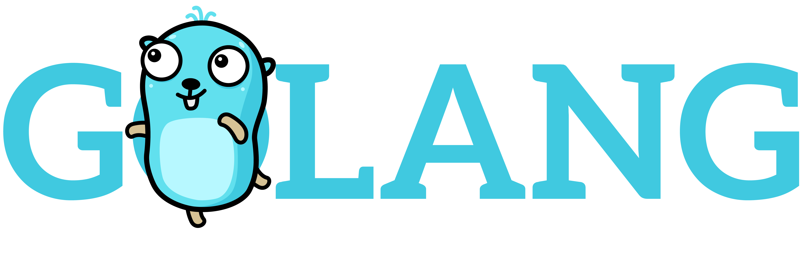

# Coding style

We want to produce a code that is consistent between projects and developers.
So we follow linting rules for each language we use.
No code should be written (or at least merged) that don't follow those rules.
(we need to create a CI to enforce that).

## Clean code

We have an inspiration on the Clean Code (from Robert C. Martin).
You can find more information about clean code concepts [here](project_architecture.md).
Some rules we use specifically:

### The boyscout rule

"Leave your code(campground) better than you found it."

### Explicit / searchable naming

The name of the functions, the objects, the interfaces (and the variables) should be explicit, understandable and searchable (avoid `a`, `i`, ...), to mitigate with the idioms of the tech you are using.

# Language specific

## Javascript / React

We use ESLint.
The linting rules we follow are based on Airbnb's rules.
We just add some modifications:
* `"react/jsx-filename-extension": [1, { "extensions": [".js", ".jsx"] }]`: we use `.js` files
* `"react/forbid-prop-types": [1, { "forbid": ["any", "array"] }]`: accept most of the proptypes. Just no "any" or "array" (use arrayOf instead)
* `"import/prefer-default-export": false`: we prefer default exports, but for some tools files (for example) we need to allow multiple exports

You can find an `.eslintrc.json` file in the resources folder.
These rules should be used in **every** project.
If you want to modify the ruleset we use, you can open a pull request on this project with the `.eslintrc.json` file updated and this file updated with explanation of what was changed. It'll be reviewed by all the frontend team and if accepted applied to all projects.

## Python

TODO
Misc ideas:
* pylint and [pep rules](https://www.python.org/dev/peps/pep-0008/)
* enforce black ? Or not ? @SlevinWasAlreadyTaken: yes
* @SlevinWasAlreadyTaken: enforce flake8 with a prepush hook ?

## Golang

Lot of our best practices are presented in these [slides](https://talks.golang.org/2013/bestpractices.slide).
We follow Golang best practices, so you will find most information about our coding styles [here](getting_skilled.md#golang).
[Effective Go](https://golang.org/doc/effective_go.html) is our bible.

#### Code Architecture / Design

See _Clean Architecture in Golang_ [slides](https://drive.google.com/file/d/16bACk7bp9OAVDx5VN-I2Z-hePvB99cSI/view?usp=sharing) and ask for more context if needed.

#### Formatting

Most IDE you can use have Golang packages to install in order to auto format your code.

It is mandatory to use it in order to keep format consistency.
You can find a list of advised packages to install by IDE [here](getting_skilled.md#tools-using-golang), and on internet !
