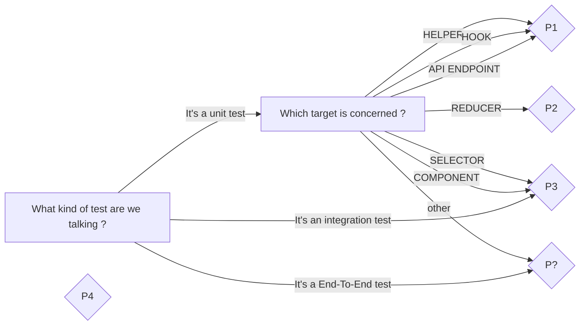
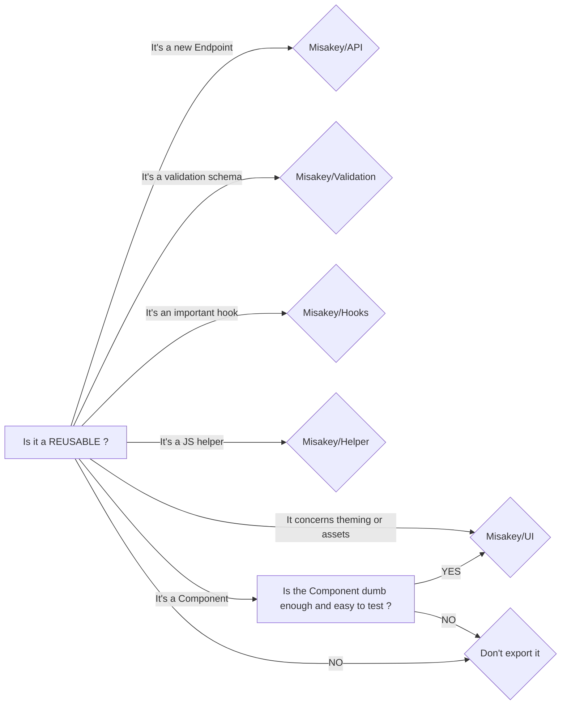

# Front-end
This documentation contains code conventions, guidelines and thought about front-end development.
It is bootstrapped thanks to React + Webpack. We use Redux as a state store.


## Table of Contents
* [File Structure](#file-structure)
* [Test Strategy](#test-strategy)
  * [Do I need to export my code ?](#do-i-need-to-export-my-code-)
* [Modules](#modules)
* [Other practices](#other-practices)
* [Improving the guidelines](#improving-the-guidelines)
* [Q&A](frontend/questionsAnswers.md)

## File Structure
```
├── public
│   ├── locales # i18next translations
│   ├── env.js # Mandatory file for env managment (not using ENV vars anymore)
├── src
│   ├── API
│   │   ├── endpoints
│   │   │   ├── definition # like auth or application
│   │   │   │   ├── index.json # define types of the endpoint
│   ├── components # https://medium.com/@dan_abramov/smart-and-dumb-components-7ca2f9a7c7d0
│   │   ├── dumb # presentation components
│   │   │   ├── Component
│   │   │   │   ├── index.js
│   │   │   │   ├── index.test.js # tests are important for dumb components
│   │   │   │   └── Component.scss
│   │   ├── screen # screen page often linked to a <Route />
│   │   ├── smart # smart component with high level logic
│   │   ├── App.js
│   ├── store
│   │   ├── actions
│   │   ├── reducers
│   └── index.js
├── package.json
``` 
Here an example of the file structure. We decided to distinguish 3 types of components as described:
* **DumbComponent** - a presentation component mostly stateless (`<SignInFormFields />`)
* **ScreenComponent** - a screen page often linked to a `<Route />` (`<Landing />`)
* **SmartComponent** - a high level logic component often connected to redux (`<AuthButton />`)

## Test Strategy
**Our priority level of testing is currently: P1**
It means we should always write test for P1 targets and consider P2 targets as bonus tests.



## Modules
Our philosophy is to reuse as much code we can and unify common behaviors.
So we created the following internal modules:
- **@misakey/API** - Instance of class API that can easily bind request in JS
- **@misakey/helpers** - Our own set of helpers extending Lodash ones
- **@misakey/hooks** - Our own set of hooks (useWith, useTimeout...)
- **@misakey/ui** - Reusable React components

### Do I need to export my code ?


## Other practices
**Our main objective is to keep a good balance between expertise and simplicity.**
* [React](frontend/react.md)
  * [Eslint](frontend/react.md#eslint)
  * [Hooks](frontend/react.md#hooks)
  * [Import](frontend/react.md#import)
  * [Redux](frontend/react.md#redux)
* [Styling](frontend/styling.md)
  * [Theme](frontend/styling.md#theme)
  * [Sass](frontend/styling.md#sass)
  * [Material UI](frontend/styling.md#material-ui)
  * [CSS in JS](frontend/styling.md#css-in-js)

## Improving the guidelines

If you want to improve the guidelines, here's the process to follow:
1. Check with the team that your improvement is a good idea / not already thought (informal discussion)
2. Create a merge request on the present guidelines. Make it approved by all the frontend team (everyone should be aware of the evolution of this document)
3. Once it's all good, you can implement it into all frontend projects

As you can see, modifying the guidelines is a heavy process. It shouldn't block you to improve it, but in a mid term, the guidelines should be stable (that's why it's important to take time to think about the big picture in the review step).
