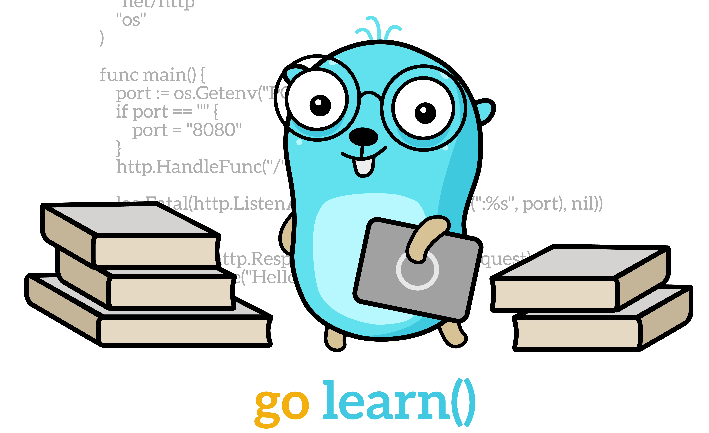

# Getting skilled

This will be a knowledge center filled with ressources to gain technical knowlege on our stack.

_________

## Golang

#### Introduction to Golang

Golang is a compiled language inspired from C and Pascal. It is a Google technology.
But instead of copy/pasting Wikipédia, **the best way to learn Go is to read about it, and practice**.

If you never practiced Golang before, here are places to go to learn about it:
1. [A Tour Of Go](https://tour.golang.org/welcome), an insane Golang and native tutorial.
2. A basic presentation [slides](https://talks.golang.org/2012/tutorial.slide), presenting implementation of small part of a service in Go.

#### Idiomatic Golang

    Idiomatic: Pertaining or conforming to the natural mode of expression of a language.

We consider to practice Go in **the most possible idiomatic way**.
The language has some limitation in design, which are meant to force us to think about code architecture. Following best practices is really important to achieve good Go software.

Golang documentation is complete: **everything is written inside**. It is the main source of truth about the language and its idioms.

Even if you've already practiced Golang, you are **strongly invited** to always refer yourself to the **[Effective Go](https://golang.org/doc/effective_go.html)** documentation.
It is essential to understand how Golang have been designed and why is the purpose of its features to use it properly.

Here follows a list of nice link to visit to learn about Golang. Sorted by categories

##### Essential
- **Simplicity is Complicated** [slides](https://talks.golang.org/2015/simplicity-is-complicated.slide) and [video](https://www.youtube.com/watch?v=rFejpH_tAHM) by Rob Pike, presenting thoughts about the Why of Golang.
- **Twelve Best Pratices** [slides](https://talks.golang.org/2013/bestpractices.slide) & [video](https://www.youtube.com/watch?v=8D3Vmm1BGoY) by Francesc Campoy.
- **Concurrent is not parallelism** [slides](https://talks.golang.org/2012/waza.slide) by Rob Pike (video linked inside).

##### General
- [Official Golang FAQ](https://golang.org/doc/faq).
- [Offical Go Talks](https://talks.golang.org).
- [Go Proverbs](https://go-proverbs.github.io/).
- Know your strongness, but also your weakness with this **Go: the Good, the Bad and the Ugly** [article](https://bluxte.net/musings/2018/04/10/go-good-bad-ugly/).

##### Concurrency
- **Go Concurrency Patterns** [slides](https://talks.golang.org/2012/concurrency.slide) by Rob Pike (video linked inside).
- **Visualizing Concurrent in Go** [articles](https://divan.dev/posts/go_concurrency_visualize/).

##### Coding style
- **What's in a name**, about naming convention in Golang [slides](https://talks.golang.org/2014/names.slide) & [video](https://www.youtube.com/watch?v=sFUSP8Au_PE) by Andrew Gerrand.
- Doing Enums in Go [article](https://blog.learngoprogramming.com/golang-const-type-enums-iota-bc4befd096d3).
- **Practical Go** [document](https://dave.cheney.net/practical-go/presentations/qcon-china.html), real world advice for writing maintainable Go programs.
- *Tricks in Go* [slides](https://talks.golang.org/2015/tricks.slide), about things we want to avoid (video linked inside).

##### Performances
- **Writing and Optimizing Go Code** [document](https://github.com/dgryski/go-perfbook/blob/master/performance.md).
- **Best practices for writing high-perfomance Go code** [document](https://github.com/dgryski/go-perfbook).

##### To infinity and beyond
- [List](https://awesome-go.com/) of libraries & frameworks in Go. Please check different sources before choosing one.
- Golang infinite [reading list](https://github.com/enocom/gopher-reading-list)
- Keep updated by reading [Lobsters Go](https://lobste.rs/t/go)
- Keep updated by watching [GophCon Videos](https://www.youtube.com/channel/UCx9QVEApa5BKLw9r8cnOFEA/videos)
- You can also subscribe to [Golang Weekly Newsletter](https://golangweekly.com/) to be up-to-date with new releases ! Aside of releases, it shares mostly beginner articles and tutorials so it is good to start reading about what can be done using Go, Lobsters being in general more advanced stuff.
- [...]

#### Tools using Golang

Golang community considers `VSCode` and `Goland` (a bit heavy but more efficient for refactoring) as best IDE to code using Golang. It is even common to switch between IDE according to needs.

But feel free to work with your favorite IDE.

List of advised packages by IDE:
- **Atom**: `go-plus`, `go-debug`, `go-imports`, `go-signature-statusbar`.
- **VSCode**: `Go`.
- **Goland**: `...`.

Beside the IDE, most of tools you will need depends of your project or are available using `go` command !

_________

## Python
_________
## React / Redux
_________
## OPs
